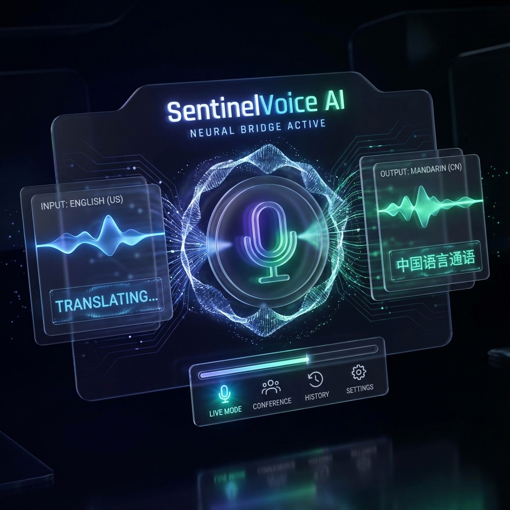

# SentinelVoice AI

<div align="center">
  
  <br>
  <h3><b>Ethereal Neural Bridge: Breaking Language Barriers with Intent and Safety.</b></h3>
  <p>An advanced AI-powered voice translation and reasoning platform.</p>
  
  [](https://silverfangvoice.vercel.app)
  [](https://github.com/ShivamRaut16/SilverFangVoice)
</div>

---

## 🚀 Overview

**SentinelVoice AI** is a state-of-the-art communication guardian designed to preserve the semantic integrity and emotional intent of spoken language. Unlike traditional translators, it acts as a **Reasoning Bridge**, utilizing multi-pass verification to ensure that what you say is exactly what is heard—in any language.

### Key Modes:
- **Snapshot Mode**: Deep reasoning and multi-pass semantic verification for complex phrases.
- **Live Neural Link**: Low-latency, real-time audio translation for seamless conversations.

## ✨ Features

- **Intent Preservation**: Analyzes emotional tone and functional goals to keep meanings accurate.
- **Semantic Grounding**: Uses deep search (Gemini Grounding) to verify cultural idioms and facts in real-time.
- **Safety Analysis**: Built-in risk evaluation engine that identifies potential harm or ambiguity.
- **Neural TTS**: High-fidelity voice synthesis via Gemini and ElevenLabs.
- **Glassmorphic UI**: A premium, responsive dashboard designed for high-end professional use.

## 🛠️ Built With

### Core Technologies
- **Frontend**: [React 19](https://react.dev/), [Vite](https://vitejs.dev/), TypeScript
- **AI Models**: Google Gemini 2.5 Flash & 3 Pro Preview
- **Voice Synthesis**: ElevenLabs & Gemini TTS
- **Deployment**: [Vercel](https://vercel.com/)

### Google Cloud Products
- **Gemini Multimodal Models**: Powering real-time audio analysis and reasoning.
- **Generative AI SDK**: Core model orchestration.

## 📥 Getting Started

### Prerequisites
- Node.js (Latest LTS recommended)
- A Gemini API Key from [Google AI Studio](https://aistudio.google.com/)

### Installation

1. **Clone the repository:**
   ```bash
   git clone https://github.com/ShivamRaut16/SilverFangVoice.git
   cd SilverFangVoice
   ```

2. **Install dependencies:**
   ```bash
   npm install
   ```

3. **Configure Environment:**
   Create a `.env.local` file in the root directory:
   ```env
   VITE_GEMINI_API_KEY=your_gemini_api_key_here
   ```

4. **Run the application:**
   ```bash
   npm run dev
   ```

## 📖 Learn More
Check out our detailed documentation for a deeper dive:
- [About the Project](about.md) - The story, inspiration, and challenges.
- [Elevator Pitch](elev.md) - A quick summary of our vision.
- [Tech Stack](build.md) - Detailed breakdown of tools and technologies.

---

<div align="center">
  <p>Developed by **Team SilverFang** | Built with ❤️ by Shivam Raut and Meet Shah</p>
</div>
